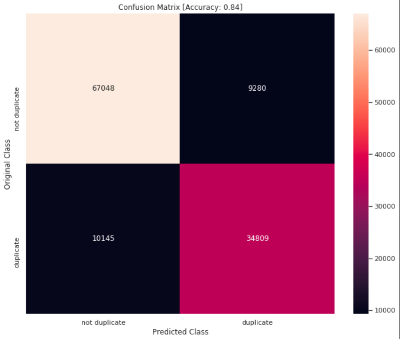

# List of Projects

- [**Web Scraping**:](#web-scraping)
  - [Web crawler for scraping stock fundamentals](#web-crawler-for-scraping-stock-fundamentals)
- [**Machine Learning**](#machine-learning)
  - [Used Car Price Prediction - MachineHack](#used-car-price-prediction---machinehack)
  - [Amazon Food Reviews](#amazon-food-reviews)
  - [Quora Question Similarity](#quora-question-similarity)
  - [Netflix Recommendation: winners solution Implementation](#netflix-recommendation-winners-solution-implementation)
  - [Understanding PCA through image visualization](#understanding-pca-through-image-visualization)
- [**Deep Learning**](#deep-learning)
  - [Planet Amazon Kaggle](#planet-amazon-kaggle)
  - [Image Caption Generator](#image-caption-generator)
  - [Machine Translation - Transformer based](#machine-translation---transformer-based)
- [**Web Development**](#web-development)
  - [Building Portfolio website using Django - Heruko deployment](#building-portfolio-website-using-django---heruko-deployment)

-----

## **Web Scraping**:
### [Web crawler for scraping stock fundamentals](https://github.com/Skumarr53/Stock-Fundamental-data-scraping-and-analysis)

Topics: *Web scraping, Automation, Selenium, BeautifulSoup, stock investing*

<i>performance indicators trends of Avanthi feeds</i>

* Built a web crawler to allow investors to choose fundamentally sound stocks for long term investment by generating review plots in an automated fashion.
* Scraped data from over 3000 stock pages from [Screener](https://www.screener.in/) using python and selenium and cleaned up data.
* Web crawler crawls selected stock pages, scrapes historical stock data, and generates plot on the fly. 

-------

## **Machine Learning**

### [Used Car Price Prediction - MachineHack](https://github.com/Skumarr53/Used-Car-Price-Prediction) 

Topics: *Regression, sklearn pipeline, Flask, HTML, JQuery, Docker, AWS* 

**AWS link**: http://usedcarpricepredict-env.eba-jdefnbzx.us-east-1.elasticbeanstalk.com/

<i>working App developed using Flask</i>

* Built an end-to-end feature transformation and model selection pipeline for predicting the price of used Cars, helping buyers to make an informed purchase.
* Optimized Linear, Random Forest, GBDT, and XGBoost Regressors using GridsearchCV to reach the best model.
* **Gradient Boosting Regressor** turned out to be the best model with a Mean Squared Logarithmic Error (MSLE) of **0.033**. 
* Designed an interactive Web application for model deployment using **Flask** framework and Hosted on [**AWS**](http://usedcarpricepredict-env.eba-jdefnbzx.us-east-1.elasticbeanstalk.com/) using Elastic Beanstalk service via **Docker** image.

-------
### [Amazon Food Reviews](https://github.com/Skumarr53/Amazon-Food-Reviews-Kaggle)

Topics: *Sentiment analysis, sklearn pipeline, Text-processing, Word2Vec, Gensim,*

<i>Top most useful features</i>

* Built a Sentiment analysis tool that classifies reviews to gain an overview of the customer's opinion in real-time. 
* Engineered features from the text using BOW, TFIDF, Word2Vec, Average Word2Vec, Tfidf weighted word2vec featurization techniques
* Optimized k-nearest neighbors, Naive Bayes, SVM, and Logistic classifiers using GridsearchCV to reach the best model.
*  **Logistic Regression** with **TFIDF** Vectorization turned out to be the best model with AUROC of **0.982** and **93**% accuracy.

-------

### [Quora Question Similarity](https://github.com/Skumarr53/Quora-Question-Similarity-Kaggle)

Topics: *Classification, sklearn pipeline, Text-processing, Word2Vec, Gensim, Spacy*

<i>confunsion matrix of best model</i>

* Built a Classifier that identifies duplicate questions on Quora to enhance the user experience by instantly providing answers to questions that have already been answered. 
* Created an NLP transformation pipeline for extracting basic, fuzzy, TFIDF, and Word2Vec features.
* Optimized Logistic, Support Vector, and XGBoost classifiers using GridsearchCV to reach the best model.
* **XGBoost classifier** turned out to be the best model with **84**% accuracy.

-------
### [Netflix Recommendation: winners solution Implementation](https://github.com/Skumarr53/Netflix-Recommender-System)

Topics: *collaborative filtering, Matrix factorization, Surprise*

<i>Feature importance plot</i>

* Built a recommendation system to make personal movie recommendations based on each customer’s unique tastes
* Extracted basic features such as Global avg. ratings, avg. rating for each user and movie, Avg. ratings of top similar users and movies. 
* Extracted features from hypertuned KNN, SVD, and SVD++ **baseline** models.  
* Optimized **XGBoost** Regressor to reach the best model with **0.967** RMSE.

-------

### [Understanding PCA through image visualization](https://github.com/Skumarr53/Principal-Component-Analysis-testing-on-Image-data)

Topics: *PCA, Image processing, Dimensionality reduction*

* Built a PCA model from scratch in Python, to test on Multi-spectral satellite image data.
* The first three Principal components retained **93**% information.

-------
## **Deep Learning**

### [Planet Amazon Kaggle](https://github.com/Skumarr53/Planet-Amazon-Kaggle)

Topics: *Multi-label classification, CNN, transfer learning, Fastai*

* Built CNN model that identifies various atmospheric conditions and classes of land cover/land use, trained with **Fastai**, helping governments and local stakeholders respond more quickly and effectively to deforestation and human encroachment. 
* Achieved **0.93** f-score using pre-trained **ResNet-50** architecture.

-------

### [Image Caption Generator](https://github.com/Skumarr53/Image-Caption-Generation-using-Fastai)

Topics: *PyTorch, Fastai, Caption Generation, Flask deployment, transfer learning, Encoder-Decoder, Beam search*

<i>Working caption generation app</i>

* Implemented image caption generation method discussed in **Show, Attend and Tell** paper using **Fastai** framework to describe the content of images. 
* For encoder part, pre-trained **ResNet-101** model is used and **LSTM** for decoder. Achieved **24** **BLEU** score for Beam search size of 5. 
* Designed a Web application and built a client-facing API using **Flask** framework.

-------

### [Machine Translation - Transformer based](https://github.com/Skumarr53/Attention-is-All-you-Need-PyTorch)

Topics: *PyTorch, NLP, Fastai, Bert transformer, Encoder-Decoder, Streamlit*

<i>Working translation App</i>

* Implemented **Transformer** based neural machine translation method proposed in **Attention Is All You Need** paper using **Fastai** framework to translate queries French-to-English. 
* Achieved **59** **BLEU** score using **BERT** architecture. 
* Designed a Web application and built a client-facing API using **Streamlit** framework.

--------

## **Web Development**

### [Building Portfolio website using Django - Heruko deployment](https://skumar-djangoblog.herokuapp.com/blog/)
Topics: *Web-development, Django, Html, JQuery, Heroku*

**website link**: https://skumar-djangoblog.herokuapp.com/

* Developed a personal website using **Django** framework for sharing my ideas and projects.
* website is hosted on **Heruko**.